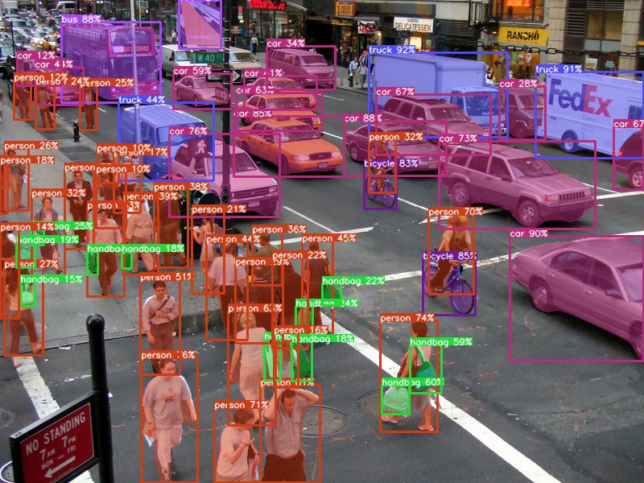

<div align="center">

YOLOv9 ONNX Segmentation
===========================

[](https://www.python.org/downloads/release/python-31012/)
[](https://developer.nvidia.com/cuda-downloads)
[](https://github.com/spacewalk01/depth-anything-tensorrt/blob/main/LICENSE)

</div>

Instance and panoptic segmentation using yolov9 in onnxruntime.

<p align="center">
  
</p>


## 🚀 Quick Start

Download [gelan-c-pan.pt](https://github.com/WongKinYiu/yolov9/releases/download/v0.1/gelan-c-pan.pt)

Prepare an onnx model:
``` shell
git clone https://github.com/WongKinYiu/yolov9
pip install -r requirements.txt
python export.py --weights gelan-c-pan.pt --include onnx
```

Perform inference:
``` shell
git clone https://github.com/spacewalk01/yolov9-onnx-segmentation.git
cd yolov9-onnx-segmentation/onnxruntime
python main.py --model <onnx model> --input <image or folder or video>
```
Example:
``` shell
python main.py --model gelan-c-pan.onnx --input zidane.jpg
```

## 👏 Acknowledgement

This project is based on the following projects:
- [YOLOv9](https://github.com/WongKinYiu/yolov9) - YOLOv9: Learning What You Want to Learn Using Programmable Gradient Information.
- [ONNX-YOLOv8-Instance-Segmentation](https://github.com/ibaiGorordo/ONNX-YOLOv8-Instance-Segmentation) - Python scripts performing Instance Segmentation using the YOLOv8 model in ONNX.
